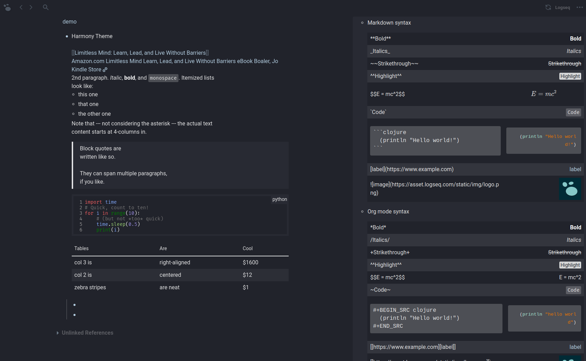
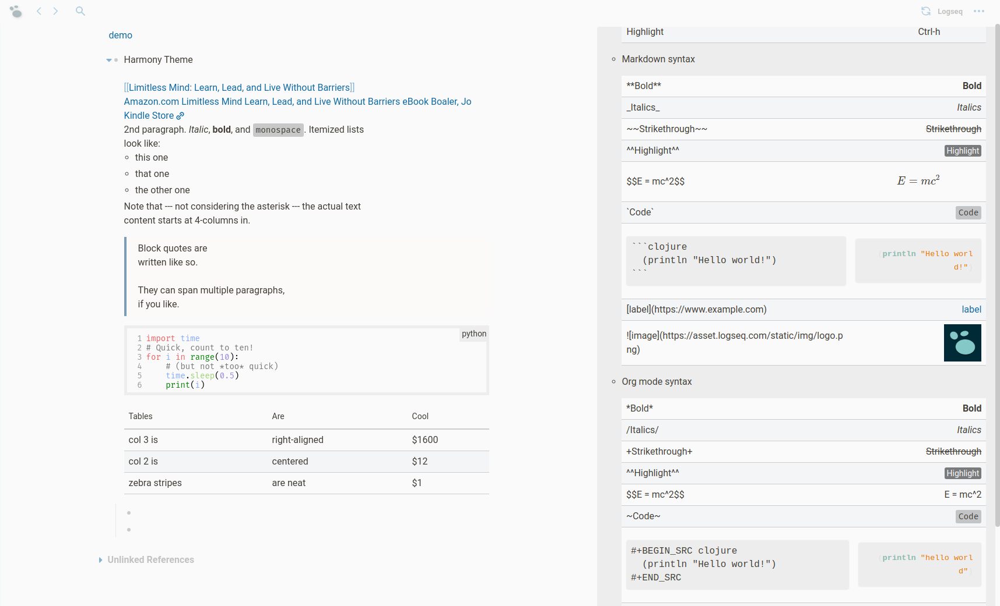

# Harmony theme for [Logseq](https://github.com/logseq/logseq)
Minimalistic custom dark and white themes keeping the classic approach of the standard Logseq theme.

## Features

- modern design with pleasing to the eyes
- beautiful minimalistic tags with simple animations
- internal and external links are more distinguishable 
- increase image size on hover
- custom code blocks style
- and many more...

## Installation

1. Download `custom.css` file
2. Find file `custom.css` in your Logseq repo (in `logseq` folder) and replace with downloaded file
